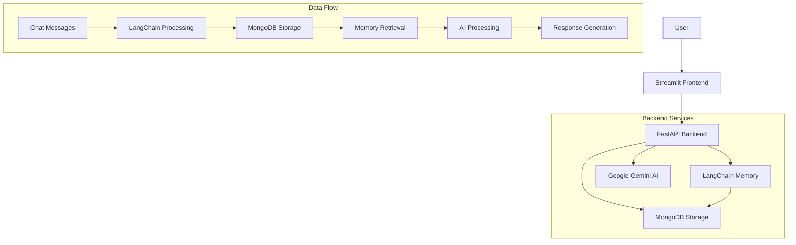

# 🤖 Chat Summarization API with LangChain MongoDB

A comprehensive chat application with AI-powered summarization, memory-enhanced conversations, and MongoDB storage using LangChain integration.

## 📋 Table of Contents

- [Features](#-features)
- [File Structure](#-file-structure)
- [Prerequisites](#-prerequisites)
- [Installation](#-installation)
- [Configuration](#-configuration)
- [Usage](#-usage)
- [API Endpoints](#-api-endpoints)
- [Frontend Features](#-frontend-features)
- [Architecture](#-architecture)
- [Troubleshooting](#-troubleshooting)
- [Contributing](#-contributing)

## 🚀 Features

### Core Functionality
- **Memory-Enhanced Conversations**: LangChain-powered conversation memory
- **AI Summarization**: Google Gemini-powered chat summarization
- **Context-Aware Q&A**: Ask questions about previous conversations
- **Session Management**: Persistent chat sessions with MongoDB
- **Real-time Chat**: Interactive chat with AI responses
- **Search & History**: Search through conversation history

### Technical Features
- **LangChain Integration**: Seamless memory management and conversation chains
- **MongoDB Storage**: Scalable document storage with ObjectId handling
- **FastAPI Backend**: High-performance REST API with automatic documentation
- **Streamlit Frontend**: Interactive web interface
- **Async Operations**: Non-blocking database operations
- **Error Handling**: Robust error management and logging

## 📁 File Structure

```
chat-summarization-api/
│
├── 📄 README.md                    # Project documentation
├── 📄 requirements.txt             # Python dependencies
├── 📄 .env                         # Environment variables template
├── 📄 .gitignore                   # Git ignore file
│
├── 📁 src/                         # Source code directory
│   ├── 📄 store.py                # MongoDB + LangChain storage layer
│   ├── 📄 helpers.py              # Chat processing and AI integration
│   └── 📄 prompt.py               # LLM prompt templates
│
├── 📄 app.py                       # FastAPI application
├── 📄 frontend.py                  # Streamlit frontend
├── 📄 run_app.py                   # Application launcher
```

## 🔧 Prerequisites

- **Python 3.10**
- **MongoDB** (local or cloud instance)
- **Google API Key** (for Gemini AI)
- **Git** (for version control)

## 📦 Installation

### 1. Clone the Repository

```bash
git clone https://github.com/yourusername/chat-summarization-api.git
cd chat-summarization-api
```

### 2. Create Virtual Environment

```bash
# Create virtual environment
python -m venv venv

# Activate virtual environment
# On Windows:
venv\Scripts\activate
# On macOS/Linux:
source venv/bin/activate
```

### 3. Install Dependencies

```bash
# Install all required packages
pip install -r requirements.txt
```

### 4. Install MongoDB

#### Option A: Local MongoDB
- **Windows**: Download from [MongoDB Community Server](https://www.mongodb.com/try/download/community)
- **macOS**: `brew install mongodb-community`
- **Linux**: Follow [official MongoDB installation guide](https://docs.mongodb.com/manual/installation/)

#### Option B: MongoDB Atlas (Cloud)
1. Create account at [MongoDB Atlas](https://www.mongodb.com/atlas)
2. Create a free cluster
3. Get connection string

## ⚙️ Configuration

### 1. Environment Variables

Create a `.env` file in the project root:

```env
# Google AI Configuration
GOOGLE_API_KEY=your_google_api_key_here

# MongoDB Configuration
MONGODB_URL=mongodb://localhost:27017
DATABASE_NAME=chat_summarization

# API Configuration
API_HOST=0.0.0.0
API_PORT=8000

# Frontend Configuration
STREAMLIT_PORT=8501
API_BASE_URL=http://localhost:8000
```

### 2. Get Google API Key

1. Go to [Google AI Studio](https://makersuite.google.com/app/apikey)
2. Create a new API key
3. Copy the key to your `.env` file

### 3. MongoDB Setup

#### Local MongoDB
```bash
# Start MongoDB service
# Windows (if installed as service):
net start MongoDB
```

#### MongoDB Atlas
1. Whitelist your IP address
2. Create database user
3. Use connection string in `.env` file

## 🚀 Usage

### Quick Start (Recommended)

```bash
# Run both API and frontend together
python run_app.py
```

This will:
- ✅ Check all dependencies
- ✅ Verify environment configuration
- 🚀 Start FastAPI backend on http://localhost:8000/docs
- 🎨 Start Streamlit frontend on http://localhost:8501
- 🌐 Open browser tabs automatically

### Manual Start (Development)

#### Terminal 1 - API Backend
```bash
python app.py
# or
uvicorn app:app --host 0.0.0.0 --port 8000 --reload
```

#### Terminal 2 - Frontend
```bash
streamlit run frontend.py --server.port 8501
```

### Access Points

- **📚 Swagger API Documentation**: http://localhost:8000/docs
- **🎨 Streamlit Web Interface**: http://localhost:8501
- **🔧 API Health Check**: http://localhost:8000/

## 🔌 API Endpoints

### Core Chat Operations

| Method | Endpoint | Description |
|--------|----------|-------------|
| `POST` | `/chats` | Store complete chat session |
| `POST` | `/chats/message` | Add single message to session |
| `GET` | `/chats/{session_id}` | Retrieve chat session |
| `DELETE` | `/chats/{session_id}` | Delete chat session |

### AI Features

| Method | Endpoint | Description |
|--------|----------|-------------|
| `POST` | `/chats/summarize` | Generate AI summary |
| `POST` | `/chats/ask` | Context-aware Q&A |
| `POST` | `/chats/chat` | Memory-enhanced chat |

### Utility Operations

| Method | Endpoint | Description |
|--------|----------|-------------|
| `GET` | `/users/{user_id}/chats` | Get chat history |
| `GET` | `/search` | Search conversations |
| `GET` | `/memory/{session_id}` | Get LangChain memory |

### Example API Usage

```python
import requests

# Store a chat session
response = requests.post("http://localhost:8000/chats", json={
    "session_id": "unique-session-id",
    "chat_messages": [
        {"conversation_id": "conv1", "message": "Hello!"},
        {"conversation_id": "conv1", "message": "How are you?"}
    ]
})

# Generate summary
summary = requests.post("http://localhost:8000/chats/summarize", json={
    "session_id": "unique-session-id"
})

# Ask a question with context
answer = requests.post("http://localhost:8000/chats/ask", json={
    "session_id": "unique-session-id",
    "question": "What did we discuss earlier?"
})
```

## 🎨 Frontend Features

### Streamlit Web Interface

#### 💬 Chat Tab
- **Real-time messaging**: Send and receive messages
- **Memory-enhanced chat**: AI remembers conversation context
- **Session management**: Create, load, and switch sessions

#### 📄 Summary Tab
- **AI summarization**: Generate conversation summaries
- **Batch processing**: Summarize any session by ID
- **Export options**: Copy or save summaries

#### ❓ Q&A Tab
- **Context-aware answers**: Ask questions about conversations
- **Smart responses**: AI uses full conversation history
- **Interactive Q&A**: Continuous question-answer flow

#### 📚 History Tab
- **Recent conversations**: Browse recent chat sessions
- **Search functionality**: Find conversations by content
- **Session loading**: Load any historical session

## 🏗️ Architecture

### System Overview



### Key Components

#### 1. **Storage Layer** (`src/store.py`)
- **MongoDB Integration**: Document storage with ObjectId handling
- **LangChain Memory**: Conversation memory management
- **Async Operations**: Non-blocking database operations
- **Session Management**: Persistent chat sessions

#### 2. **Processing Layer** (`src/helpers.py`)
- **AI Integration**: Google Gemini for chat processing
- **Memory Systems**: LangChain conversation chains
- **Context Management**: Smart context-aware responses
- **Summarization**: AI-powered conversation summaries

#### 3. **API Layer** (`app.py`)
- **FastAPI Framework**: High-performance REST API
- **Request Validation**: Pydantic models for data validation
- **Error Handling**: Comprehensive error management
- **Documentation**: Automatic OpenAPI documentation

#### 4. **Frontend Layer** (`frontend.py`)
- **Streamlit Interface**: Interactive web application
- **Real-time Updates**: Live conversation updates
- **Session Management**: Visual session handling
- **Search & History**: Conversation browsing tools


## 🔍 Troubleshooting

# Verify API key in .env file
echo $GOOGLE_API_KEY


# Test API key
curl -H "Authorization: Bearer YOUR_API_KEY" \
  https://generativelanguage.googleapis.com/v1/models
```

#### 5. **Port Already in Use**
```bash
# Find process using port 8000
lsof -i :8000

# Kill process (replace PID)
kill -9 PID

# Or use different ports in .env
API_PORT=8001
STREAMLIT_PORT=8502
```

### Debug Mode

Enable debug logging by setting environment variable:
```bash
export DEBUG=True
python app.py
```

### Log Files

Check application logs for detailed error information:
- **FastAPI logs**: Console output from `python app.py`
- **Streamlit logs**: Console output from `streamlit run frontend.py`
- **MongoDB logs**: Check MongoDB log files

## 🧪 Testing

### Run Tests

```bash
# Install test dependencies
pip install pytest pytest-asyncio httpx

# Run all tests
pytest

# Run specific test file
pytest tests/test_api.py

# Run with coverage
pytest --cov=src tests/
```

### Manual Testing

1. **API Testing**: Use Swagger UI at http://localhost:8000/docs
2. **Frontend Testing**: Use Streamlit interface at http://localhost:8501
3. **Database Testing**: Check MongoDB collections using MongoDB Compass

## 🚀 Deployment

### Local Development
```bash
python run_app.py
```

### Production Deployment

#### Using Docker
```dockerfile
FROM python:3.10-slim-bluster

WORKDIR /app
COPY requirements.txt .
RUN pip install -r requirements.txt

COPY . .
EXPOSE 8000 8501

CMD ["python", "run_app.py"]
```

#### Using Cloud Services
- **Backend**: Used FastAPI to develop the API and used Langchain and google gemini 2.5 model for developing model.
- **Database**: Use MongoDB Atlas for cloud database
- **Frontend**: Deploy Streamlit to Streamlit Cloud


## 🙏 Acknowledgments

- **LangChain**: For powerful conversation memory management
- **FastAPI**: For high-performance API framework
- **Streamlit**: For easy-to-build web interfaces
- **MongoDB**: For flexible document storage
- **Google AI**: For advanced language model capabilities
---

## 🚀 Quick Start Checklist

- [ ] Clone repository
- [ ] Install Python 3.10
- [ ] Install MongoDB
- [ ] Create virtual environment
- [ ] Install dependencies: `pip install -r requirements.txt`
- [ ] Get Google API key
- [ ] Create `.env` file with required variables
- [ ] Start MongoDB service
- [ ] Run application: `python run_app.py`
- [ ] Open browser: http://localhost:8501

**Happy Chatting! 🤖💬**